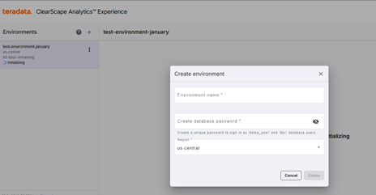
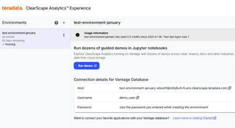
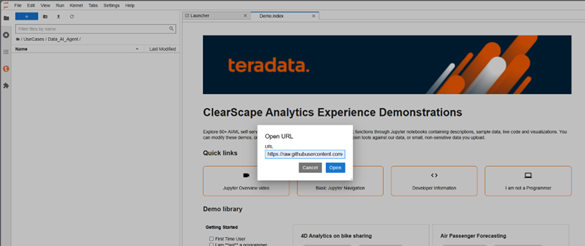

# Build a Data Analyst AI Agent from Scratch  

The concepts of agents, intelligent agents, and autonomous agents have been extensively studied in academia long before the advent of commercial Large Language Models (LLMs). An agent can be broadly defined as a system that, when given a specific goal and a set of tools, works toward achieving that goal by utilizing the tools at its disposal.  

## Components of an Agent  
This kind of system is comprised of three main components:  
- **Goal definition** – The objective the agent aims to achieve.  
- **Tools** – Resources or functions available to the agent to help accomplish its goal.  
- **Logic for decision-making** – The reasoning process that determines the path to achieving the goal and orchestrating the tools effectively.  

The use of LLMs for determining the path to achieve a goal, sequencing tool usage, and managing unexpected states is commonly referred to as **Agentic AI**.  

Two key properties of LLMs make them particularly effective as an orchestration engine compared to other alternatives:  
1. **Embedded knowledge** – LLMs contain a vast amount of information extracted from their training data, enabling them to handle a wide variety of states with minimal instructions.  
2. **Structured responses** – LLMs can be prompted to generate structured outputs that simplify implementation within an agent system, which, at its core, is just a program.  

## This Project - Data-Focused AI Agent  

In this example, we build an AI Agent with the following characteristics:  

- **Goal:** Answer business-related questions provided by the user, in English, based on the information contained in a database.  
- **Tools:**  
  - A function that executes SQL statements in a **Teradata Vantage** database.  

## Requirements  

To build this project, we need the following resources:  

- **A Teradata VantageCloud development environment with Jupyter Notebook integration.**  
  - [Get one for free at ClearScape Analytics Experience](https://www.teradata.com/getting-started/demos/clearscape-analytics?utm_campaign=gbl-clearscape-analytics-devrel&utm_content=demo&utm_id=7016R000001n3bCQAQ).  
- **API access to an LLM.**  
  - The sample notebook uses OpenAI's API, but this can be changed (modifications to API calls and prompt formatting may be required).  

## Setting Up the Development Environment  

1. Log in to **ClearScape Analytics Experience**.  

2. Create an environment in **ClearScape Analytics Experience**.


3. Start the **Jupyter Notebook** environment by clicking **"Run demos"**.

  
4. In the Jupyter Notebook environment, open the **"Use Cases"** folder and create a folder with a name of your choice.

5. We have several notebooks with different approaches to create the agent:

* Provide context through Teradata dbc table dictionary:  

Open the folder you've created, click on **"Open from URL"** under the **"File"** menu, and paste the following URL in the dialog box: 

[https://raw.githubusercontent.com/Teradata/simple_data_ai_agent/refs/heads/main/notebooks/simple_data_agent.ipynb](https://raw.githubusercontent.com/Teradata/simple_data_ai_agent/refs/heads/main/notebooks/simple_data_agent.ipynb). 

* Provide context through metadata generated by dbt:

Open the folder you've created, click on **"Open from URL"** under the **"File"** menu, and paste the following URL in the dialog box: 

[https://raw.githubusercontent.com/Teradata/simple_data_ai_agent/refs/heads/main/notebooks/simple_data_agent-dbt.ipynb](https://raw.githubusercontent.com/Teradata/simple_data_ai_agent/refs/heads/main/notebooks/simple_data_agent-dbt.ipynb). 


6. In the folder you created, create or load a `configs.json` file with the following structure, replacing `"your-api-key-here"` with your actual LLM API key:  
```json
{
  "llm-api-key": "your-api-key-here"
}
```

7. Notes on dependencies
* If you are running the project on ClearScape Analytics Experience using the same LLM provider as in the example, no additional libraries are required.
* If you are running the project on other Jupyter Notebook platforms or locally, additional libraries and resources may be required depending on the target environment.
* If using a different LLM provider, you may also need to install the corresponding SDK.


### Summary of the Project
The project is structure in the following sections:
1. Project Setup: This section outlines the steps required to set up the project:  
- Import necessary libraries  
- Load the required API keys  
- Establish the database connection  
- Load the sample data into the database  

2. Agent Configuration: This section covers the configuration of the agent, including:  
* Defining the data context that the agent will interact with  
* Setting up the routine the agent will follow as a system prompt (embedding the data context)  
* Establishing the list of tools available for the agent to complete its tasks

3. Agent Runtime: This section covers the code executed while the agent is in action, including:
* Preparing the tools for use by the agent
* The agent's runtime function

4. Running the Agent

### Backlog Improvements
- Recovering from errors in external tools
- Staggering passing of data context to solve complex questions